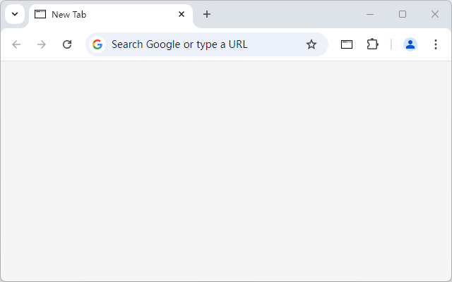
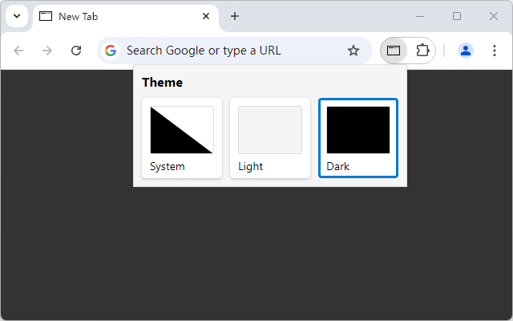

# Blank New Tab Page - White Smoke
<!-- ALL-CONTRIBUTORS-BADGE:START - Do not remove or modify this section -->

<!-- ALL-CONTRIBUTORS-BADGE:END -->
A chrome extension replaces the default new tab page to a white smoke background blank page, which also supports dark mode.

  

## License
Codes in this repository are licensed under MIT license.

Icons under 'icons' folder are licensed under [CC BY-NC](http://creativecommons.org/licenses/by-nc/4.0/). 

## Contributors ✨

Thanks goes to these wonderful people ([emoji key](https://allcontributors.org/docs/en/emoji-key)):

<!-- ALL-CONTRIBUTORS-LIST:START - Do not remove or modify this section -->
<!-- prettier-ignore-start -->
<!-- markdownlint-disable -->
<table>
  <tr>
    <td align="center"><a href="https://github.com/moxwel"> <b>Max Sepúlveda</b></a> <a href="#translation-moxwel" title="Translation">🌍</a></td>
  </tr>
</table>

<!-- markdownlint-restore -->
<!-- prettier-ignore-end -->

<!-- ALL-CONTRIBUTORS-LIST:END -->

This project follows the [all-contributors](https://github.com/all-contributors/all-contributors) specification. Contributions of any kind welcome!